# 验证登陆机制

会话（Session）跟踪是Web程序中常用的技术，用来跟踪用户的整个会话。常用的会话跟踪技术是Cookie与Session。Cookie通过在客户端记录信息确定用户身份，Session通过在服务器端记录信息确定用户身份。

## cookie机制

**Cookie机制:** Cookie技术是客户端的解决方案，Cookie就是由服务器发给客户端的特殊信息，而这些信息以文本文件的方式存放在客户端，然后客户端每次向服务器发送请求的时候都会带上这些特殊的信息。让我们说得更具体一些：当用户使用浏览器访问一个支持Cookie的网站的时候，用户会提供包括用户名在内的个人信息并且提交至服务器；接着，服务器在向客户端回传相应的超文本的同时也会发回这些个人信息，当然这些信息并不是存放在HTTP响应体（Response Body）中的，而是存放于HTTP响应头（Response Header）；当客户端浏览器接收到来自服务器的响应之后，浏览器会将这些信息存放在一个统一的位置，对于Windows操作系统而言，我们可以从： `[系统盘]:\Documents and Settings\[用户名]\Cookies`目录中找到存储的Cookie；自此，客户端再向服务器发送请求的时候，都会把相应的Cookie再次发回至服务器。而这次，Cookie信息则存放在HTTP请求头（Request Header）了。有了Cookie这样的技术实现，服务器在接收到来自客户端浏览器的请求之后，就能够通过分析存放于请求头的Cookie得到客户端特有的信息，从而动态生成与该客户端相对应的内容。通常，我们可以从很多网站的登录界面中看到“请记住我”这样的选项，如果你勾选了它之后再登录，那么在下一次访问该网站的时候就不需要进行重复而繁琐的登录动作了，而这个功能就是通过Cookie实现的。

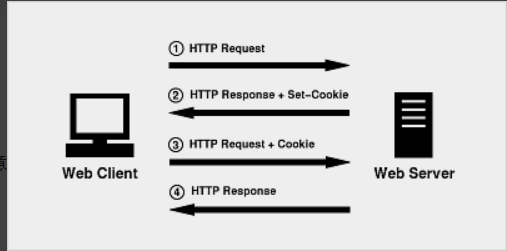

## session机制

Session是另一种记录客户状态的机制，不同的是 Cookie保存在客户端浏览器中，而Session保存在服务器上 。为了获得更高的存取速度，服务器一般把Session放在内存里。客户端浏览器访问服务器的时候，服务器把客户端信息以某种形式记录在服务器上。客户端浏览器再次访问时只需要从该Session中查找该客户的状态就可以了。
如果说Cookie机制是通过检查客户身上的"通行证"来确定客户身份的话，那么Session机制就是通过检查服务器上的"客户明细表"来确认客户身份。Session相当于程序在服务器上建立的一份客户档案，客户来访的时候只需要查询客户档案表就可以了。

## session和cookie的区别和联系

- cookie数据存放在客户端，session数据放在服务器上。
- cookie不是很安全，别人可以分析存放在本地的cookie并进行cookie欺骗，考虑到安全应当使用session。
- session会在一定时间内保存在服务器上，当访问增多，会比较占用你服务器的性能，考虑性能应当使用cookie。
- 不同浏览器对cookie的数据大小限制不同，个数限制也不相同。
- 可以考虑将登陆信息等重要信息存放为session，不重要的信息可以放在cookie中。
- 都是用来记录用户的信息，以便让服务器分辨不同的用户。
- 可以搭配使用，但都有自己的使用局限，要考虑到安全和性能的问题。

# 实训主题

## 使用cookie访问豆瓣登陆后资源

### 任务描述

在代码中模拟cookie请求，检测是否能访问豆瓣中已经登陆的数据

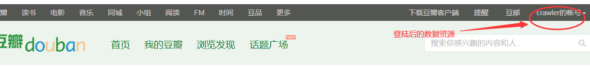

### 思路分析

- 在豆瓣网先登陆
- 将豆瓣网中的cookie信息保存到请求headers中
- requests模拟发起请求
- 检测是否能访问到登陆后的信息

### 实现过程

- 定义一个检测函数，传入url和cookie字符串
- 先将cookie字符串解析成字典以备请求时传入cookie参数
- 发起requests请求，传入headers参数和cookies参数
- 返回响应，检测是否包含用户数据

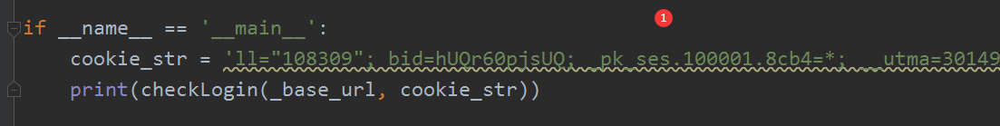

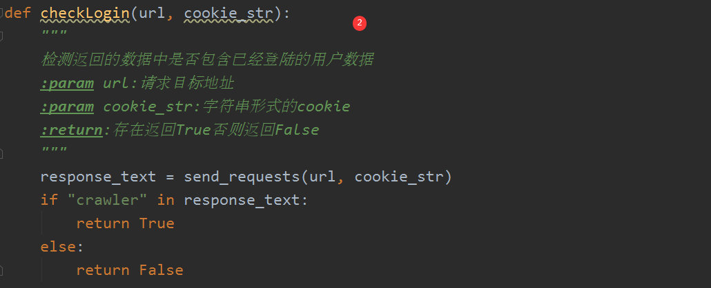

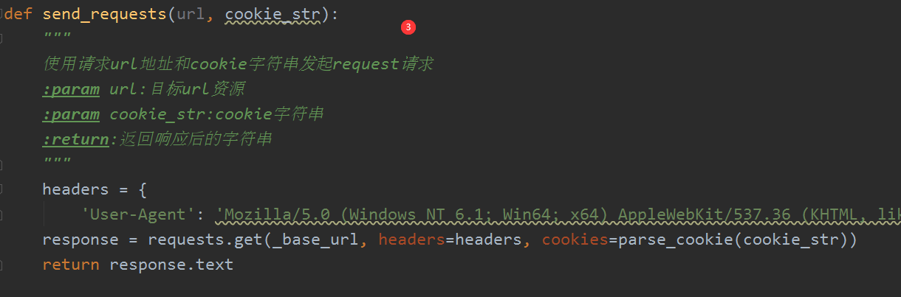

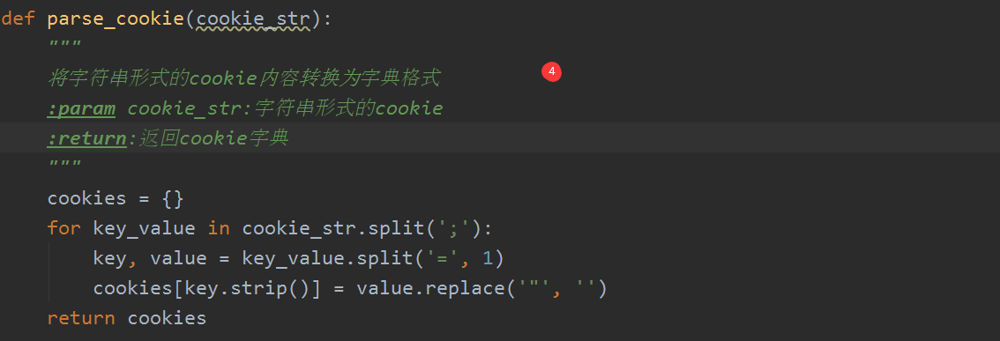

### 实现结果

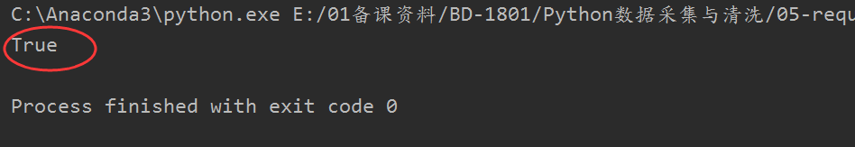

## 模拟登陆豆瓣

### 任务描述

上面是咱们手动登陆后然后去浏览器中找到cookies进行数据访问，那么如何通过自己写代码模拟手工登陆呢？

### 登陆过程分析

- 表单中输入用户名和密码点击登陆，结合浏览器找到对应的发起请求

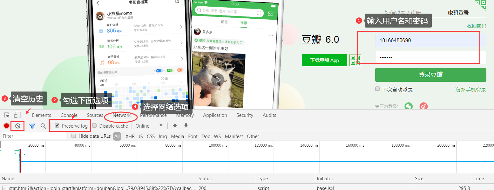

- 点击  “登陆豆瓣”  分析请求页面查看对应的表单数据

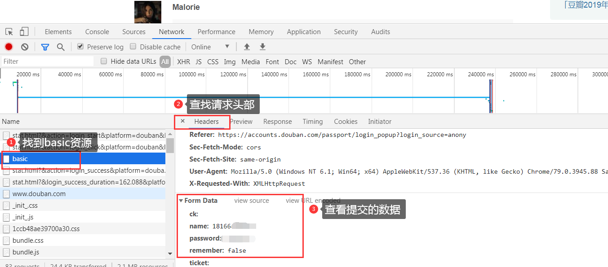

### 实现分析

使用requests会话对象模拟登陆

- 初始化一个requests会话对象，并添加请求头部
- 准备post参数发起post请求
- 响应数据检测是否登陆成功

### 实现过程

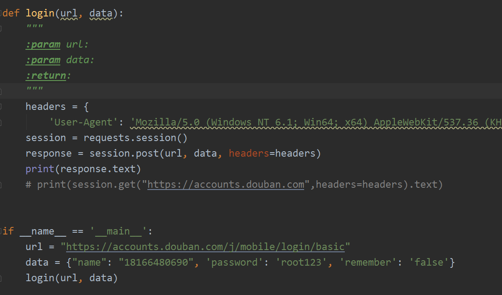

### 实现结果

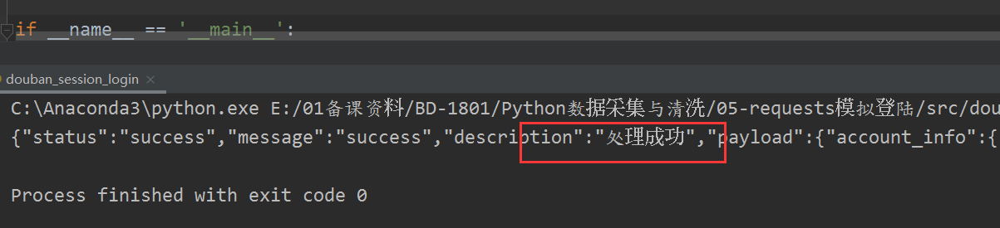 