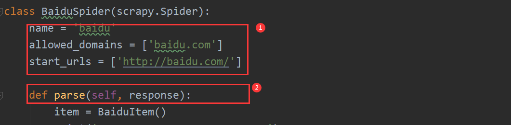

# BasicSpider类

## Scrapy模板类

在前面章节我们使用Scrapy框架的步骤中当使用第二步创建爬虫时用到以下命令：

```
scrapy genspider baidu baidu.com
```

此时会在spiders文件夹下创建一个baidu.py文件，其中会自动生成一个BaiduSpider类：

```
class BaiduSpider(scrapy.Spider):
    name = 'baidu'
    allowed_domains = ['baidu.com']
    start_urls = ['http://baidu.com/']

    def parse(self, response):
    ....
```

上面类BaiduSpider默认继承了scrapy.Spider类，这个类就是Scrapy爬虫框架提供的最基础爬虫类。

在创建爬虫时Scrapy提供四种模板支持，默认是basic，分别是：

- basic
- crawl
- csvfeed
- xmlfeed


| 模板类型 | Spider类                   | 应用场景                                                     |
| -------- | -------------------------- | ------------------------------------------------------------ |
| basic    | BasicSpider即scrapy.Spider | 常见基础爬虫，默认继承该类                                   |
| crawl    | CrawlSpider                | 可以制定一些规则（rules），使对于链接（网页）的爬取更具有通用性，通过scrapy genspider -t crawl  demo url创建 |
| csvfeed  | CSVFeedSpider              | 主要遍历以行类型CSV格式的数据                                |
| xmlfeed  | XMLFeedSpider              | 主要针对采集以XML格式的节点类型数据                          |

其中在上面的四种类型中第一种basic和第二种crawl最为常用。

## BasicSpider类

BasicSpider=scrapy.Spider，是最基础的爬虫类，我们创建爬虫时不指定模板类型默认的爬虫类就会默认继承

scrapy.Spier。



该类并没有特殊功能，仅仅是提供了一个start_requests()的默认实现，默认实现主要完成了两个功能，源码如下：


- 发起请求当前子类中的start_urls链接；
- 将上面的返回结果传递到子类中并调用上面的parser方法解析数据。

从上面的start_requests()第一个功能发现，会向目标url发起请求，如果请求目标站点url时过程中需要登录才能访问，此时必须得在子类中对start_requests()方法进行重写（重新实现）。


上面scrapy.FormRequest请求对应的url，并带上对应的表单数据，然后将请求后的响应数据response调用回调函数callback，上面的回调函数即logged_in，其中response参数就是上面的响应结果作为实参传递进来，如果没有设置对应的callback则默认直接调用parse方法开始解析数据。

# 实训主题

## 采集我爱我家房源信息

### 任务描述

使用Scrapy框架采集我爱我家二手房的房源列表信息，分别采集房源的标题、价格以及该房源的经纪人名称，但是该经纪人在详情页中，所以必须发起2层链接的数据采集。

### 思路分析

- 创建项目
- 创建爬虫
- 修改settings文件ROBOTSTXT_OBEY和DEFAULT_REQUEST_HEADERS配置
- 构造Item采集对象类
- 编写Spiders采集逻辑，分析列表页获取标题和价格，然后采集二级页面获取经纪人名称
- 运行测试

### 实现过程

- 创建项目


- 创建爬虫


此时在目录结构下生成对应的爬取文件：


- 制定Item


- 编写spider采集业务逻辑


- 运行输出结果


### 实现结果


### 注意事项

注意：在采集过程中，我爱我家使用了反爬机制，在访问页面时有时会给链接后面加入一个如下后缀且会时刻变化：

```
https://bj.5i5j.com/ershoufang/500455474.html?wscckey=cf7abd8dfcabb4c3_1581908669
```

上面链接为详情页的真实链接地址，此时需要拿到改地址，在第一次请求时在返回数据中就包含改地址：

```
<HTML><HEAD><script>window.location.href='https://bj.5i5j.com/ershoufang/500455474.html?wscckey=cf7abd8dfcabb4c3_1581908669';</script></HEAD><BODY>
```

所以我们第一次请求后判断返回内容是否是上面的数据，如果是直接从里面取出真实链接地址发起详情页请求。


## 采集图片

### 任务描述

在第一个实训结果的基础上采集到详情页中的图片数据并下载下来。

### 思路分析

解决方案：使用Scrapy框架提供的图片下载功能，框架提供了一个可重用的Item pipilines，常见的两种是ImagesPipeline和FilesPipeline，这里用ImagesPipeline，需先安装pillow库，该功能还有一个优势就是已经下载过的资源会自动识别不会重复下载。

### 实现过程

- 安装pillow；


- 创建新的爬虫，并将上面实训中可用的代码拷贝过来；


- 修改Item添加目标数据字段；


- 在settings中配置启用Images Pipeline，设置存储图片的文件夹；


- 修改spider类；


- 启动爬虫调试。


### 实现结果


### 注意事项

注意在item中的添加的字段必须是image_urls和images，因为图片的下载是交给scrapy.pipelines.images.ImagesPipeline完成的，在ImagesPipeline源码中指定的字段是：


# 总结

总结使用Scrapy采集我爱我家数据过程中的各个环节，尤其注意在采集过程中遇到的反爬机制时，我们要根据实际情况分析找到对应的策略，灵活应对这也是最难的。

# 作业

使用Scrapy框架完成对我爱我家二手房源数据的采集；

使用Scrapy框架的ImagesPipeline完成图片的采集；

总结在使用Scrapy框架中的流程和步骤。