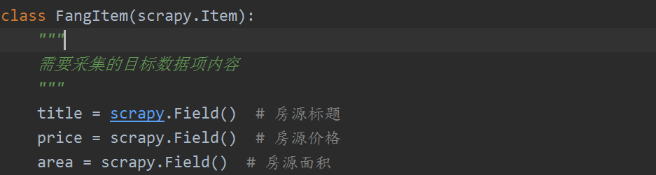

# CrawlSpider类简介

在前面我们讲解过的数据采集中，都有最为核心的一步就是明确我们要采集的目标url地址，然后向该地址发起请求，CrawlSpider类主要设计思想就是提供了一组的rules采集规则，在该规则中明确需要采集站点中的哪些请求地址，对这些地址是否进行跟进采集以及采集的回调函数的业务逻辑。

## rules理解

rules是CrawlSpider采集数据的规则对象集合，在该集合中核心参数即是LinkExtractor，其次是callback回调参数，然后是对response中提取的链接是否跟进follow，还有process_links、process_request参数。

- link_extractor

  是一个Link Extractor对象，其定义了如何从爬取到的页面提取哪些需要的链接。

- callback

  是一个callable或string（该Spider中同名的函数将会被调用）。从link_extractor中每获取到链接时将会调用该函数；该回调函数接收一个response作为其第一个参数，并返回一个包含Item以及Request对象(或者这两者的子类)的列表；需要注意的是回调函数不能是parse方法，否则采集会中断失败。

- follow

  是一个boolean值，指定了根据该规则从response提取的链接是否需要跟进。如果callback为None，follow默认设置True，否则默认False。

- process_links

  是一个callable或string（该Spider中同名的函数将会被调用）。从link_extrator中获取到链接列表时将会调用该函数。该方法主要是用来过滤。

- process_request

  是一个callable或string（该spider中同名的函数都将会被调用）。该规则提取到的每个request时都会调用该函数。该函数必须返回一个request或者None。用来过滤request。

## 链接采集规则

link_extractor被称为链接提取器，目的很简单就是提取链接，主要参数如下：

- allow：满足括号中“正则表达式”的值会被提取，如果为空，则全部匹配。
- deny：与这个正则表达式(或正则表达式列表)不匹配的URL一定不提取。
- allow_domains：会被提取的链接的domains。
- deny_domains：一定不会被提取链接的domains。
- unique：针对提取的链接是否重复过滤。

# Scrapy架构

## 核心组件

- crapy Engine(引擎): 负责Spider、ItemPipeline、Downloader、Scheduler中间的通讯，信号、数据传递等。
- Scheduler(调度器): 它负责接受引擎发送过来的Request请求，并按照一定的方式进行整理排列，入队，当引擎需要时，交还给引擎。
- Downloader（下载器）：负责下载Scrapy Engine(引擎)发送的所有Requests请求，并将其获取到的Responses交还给Scrapy Engine(引擎)，由引擎交给Spider来处理。
- Spider（爬虫）：它负责处理所有Responses,从中分析提取数据，获取Item字段需要的数据，并将需要跟进的URL提交给引擎，再次进入Scheduler(调度器)。
- Item Pipeline(管道)：它负责处理Spider中获取到的Item，并进行进行后期处理（详细分析、过滤、存储等）的地方。
- Downloader Midlewares（下载中间件）：你可以当作是一个可以自定义扩展下载功能的组件。
- Spider Middlewares（Spider中间件）：你可以理解为是一个可以自定扩展和操作引擎和Spider中间通信的功能组件（比如进入Spider的Responses;和从Spider出去的Requests）。

## 数据流

下面将介绍在数据采集过程中的数据是如何在各个组件之间进行流动的：

1. 引擎将start_urls列表中的url加入调度器(Scheduler)调度。如果重写了start_urls方法，就将最新方法中的url加近调度器。
2. 引擎向调度器请求下一个要爬取的url。
3. 调度器给引擎返回下一个要爬取的url，引擎将url通过下载中间件转发给下载器（Downloader），发起request从网络中拉取数据。
4. 一旦页面下载完毕，下载器生成一个该页面的response，并将其通过下载中间件发送给引擎，返回response。
5. 引擎将下载器中接收到的response并通过爬虫中间件（输入方向）发送给spider处理。
6. spider根据编写的提取逻辑，处理response并给引擎返回爬取到的Item及（根据规则跟进的url）新的request。
7. 引擎将（spider返回的）爬取到的Item给Item Pipeline，将(spider返回的)request给调度器。
8. 从第二步重复直到调度器中没有更多的request，引擎关闭该爬虫。

# 实训主题

## 任务描述

使用CrawlSpider的crawl基础模板采集房天下二手房的房源数据，主要采集房源标题、房源价格以及面积。

## 思路分析

首先需要分析采集的目标数据的链接地址特征。分析主站下重庆地区的二手房源列表分页地址格式如下：

| 页码   | 地址                              |
| ------ | --------------------------------- |
| 第一页 | https://cq.esf.fang.com/house/i31 |
| 第二页 | https://cq.esf.fang.com/house/i32 |
| 第三页 | https://cq.esf.fang.com/house/i33 |
| 第四页 | https://cq.esf.fang.com/house/i34 |

总结：根据上面的地址的分析https://cq.esf.fang.com/house/i3是不变的，后面紧跟对应的页码即可获取到对应数据。

详情页地址：

https://cq.esf.fang.com/chushou/3_195500181.htm

https://cq.esf.fang.com/chushou/3_195230685.htm

总结：根据上面的地址分析https://cq.esf.fang.com/chushou内容是不变的，后面紧跟的是详情页的地址htm。

根据上面的分析可以制定对应的linke_extractor规则：

1. 跟进房源列表页
2. 对列表页中符合详情页的url发起请求并解析其中的房源数据构造Item

## 实现过程

1. 创建采集项目；

   

2. 使用crawl模板创建爬虫（注意这里的开始链接要为cq.esf.fang.com）；

   

3. 构造Item目标数据字段

   

4. 编写spider类中的文件，修改start_urls为重庆二手房链接，定义核心的rules规则，导入要用到的相关的库；

   

   制定采集的链接规则rules:

   

   解决反爬的处理：

   

   

   目标数据解析：

   

5. 修改数据采集配置settings文件；

   

6. 运行项目测试。

   

## 实现结果

## 注意事项

在使用CrawlSpider进行数据采集时，特别注意对Rules的规则制定，通常用来进行对整站数据采集；在上面的数据采集过程中遇到的最大的问题就是反爬问题，天下房站点对数据采集的链接做了重定向操作，要避免链接的重定向需要指定在每次请求过程中的headers头信息以及cookies信息；另外注意在测试学习时适当采集在线数据即可，不要给在线站点带来负载压力。

# 总结

该章节进一步加强对Scrapy框架的原理进行理解，特别是核心组件之间是如何进行协调工作的，以及在Scrapy框架中数据是如何进行流动的；在Spider中的CrawlSpider的工作核心原理是如何进行的，以及对CrawlSpider中的rules进行重点理解和把握，根据实际的业务需求制定合适的rule规则。

# 作业

描述Scrapy的工作原理，包括Scrapy的核心组件以及数据流动方向；

描述CrawlSpider与Spider之间的主要差别以及CrawlSpider中的rules的作用；

使用CrawlSpider完成对房天下二手房数据的采集。