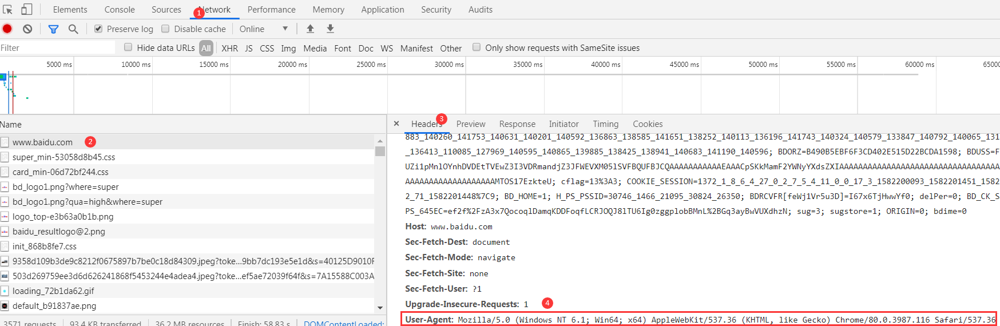

# Scrapy应对发爬虫策略

在前面我们用requests库以及Scrapy框架在数据采集过程中遇到了很多在线站点用到了反爬策略，我们分别已经使用了部分应对反爬虫的策略解决了反爬机制，在这个章节中我们对Scrapy框架应对反爬策略进行整体介绍；同时我们需要强调在实际使用数据采集过程中需要遵循robots协议，不能对在线网站进行恶意的数据访问或未经许可的情况对数据进行商业性应用。

# 常用的反爬虫设置

## 设置用户代理

### 什么是用户代理？

用户代理就是让我们程序访问在线数据时模拟我们平时使用浏览器去访问数据的过程，我们可以在浏览器中发现每次访问网络资源的时候在访问的http请求头部中都有一个User-Agent属性，即用户代理就是指的该User-Agent。



大家可以发现User-Agent的值操作系统信息、浏览器类型版本等信息。

```
User-Agent: Mozilla/5.0 (Windows NT 6.1; Win64; x64) AppleWebKit/537.36 (KHTML, like Gecko) Chrome/80.0.3987.116 Safari/537.36
```

### 如何设置用户代理？

1. 在settings.py配置文件中设置

   

2. 设置默认请求头headers

3. 在代码中的scrapy.Request中添加headers参数

4. 在中间件中定义headers

## 设置下载延迟

## 设置cookies

## 使用代理IP

## 自动限速扩展

## 其他应对策略

# 下载器中间件

## 下载器中间件简介

## 激活下载器中间件

## 编写下载器中间件

# 用户代理和IP代理

## 设置随机用户代理

## 设置随机Ip代理

# 总结

# 作业


